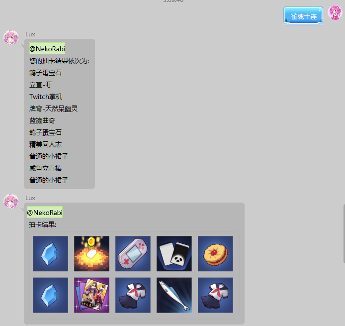
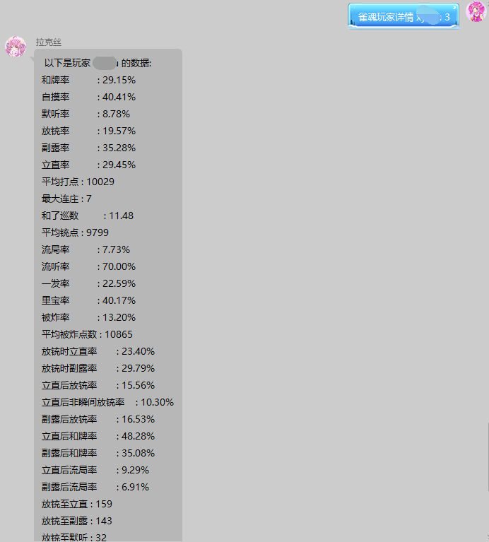
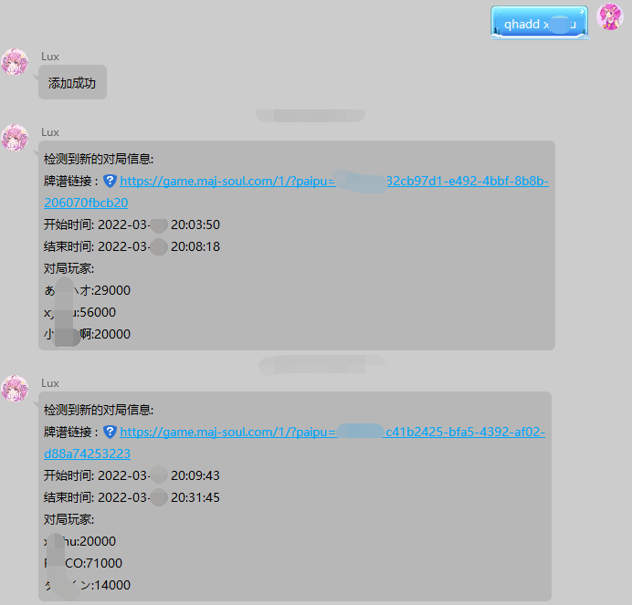
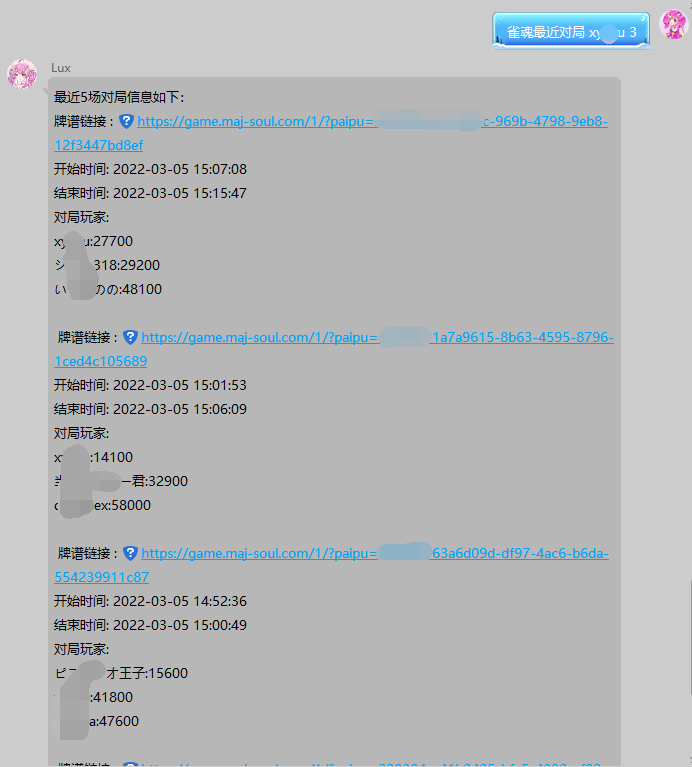
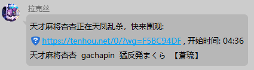
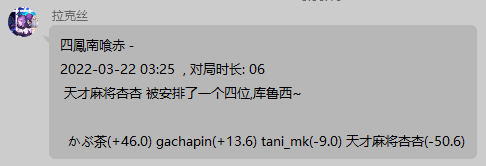

# Majsoul-QQBot
一个基于YiriMirai的QQ机器人，主要有雀魂和天凤的相关功能(如查询、十连、监控等等)，还有一些娱乐性的功能，比如入群欢迎，制作/发送图片，随机复读等等。有python基础的也可以自己写插件

**以上功能现在全部作为插件使用**

# [指令帮助](./docs/command_help.md)

# [自定义指令帮助](./docs/reg-command_help.md)


# [简单的插件编写教程](./docs/HowToCreateYourFirstPlugin.md)

# 效果展示

## 十连模拟抽卡



## 查一个玩家的数据



## 自动播报对局信息




## 查询玩家的最近对局情况



## 对局开始报幕



## 对局结算播报



# 如何实现

雀魂数据来自[雀魂牌谱屋](https://amae-koromo.sapk.ch/), 通过定时爬取来获取牌谱。

以后可能会改成从雀魂直接获取数据 ( 等我会使用 websocket )

天凤数据来自角田提供的 [数据接口](https://tenhou.net/sc/raw/), 自行存储数据


# 常见错误

[查看帮助](./docs/faq.md)

# 如何使用

### 下载代码使用

需要先安装 mirai 和 mirai-api-http，在mirai-api-http的配置文件中修改adapter和adapterSettings，再下载本程序，在config.yml中配置好相关参数后就可以直接使用命令行启动。

如果Mirai安装了`chat-command`，建议在Mirai控制台界面中输入 `/perm permit u* console:command.help`，来禁用Mirai的帮助输出。

可以参考 YiriMirai 的[官方文档](https://yiri-mirai.wybxc.cc/docs/quickstart)的快速部署。

可以使用 ``` pip install -r requirements.txt``` 来快速安装所需依赖。 *也可以双击bat文件*

我提供了自己的 [Mirai](./other/自用mirai/mcl1.0.6.zip) 和 [Mirai-Api-Http](./other/mirai-api-http/setting.yml) 配置，可以直接进行复制和替换。

本程序 `WebSocketAdapter` 的端口号为 `17280`。 


配置文件填写好后就可以启动了。双击 `start.bat` 或者打开命令行(cmd)，执行`python main.py`


### 下载编译好的exe使用

exe不包含资源文件，需要另外下载，下载好后需要放到对应文件夹中

下载好后，双击exe启动，会自动生成一些配置文件，填好文件应该就能使用。


**<font color='red'>启动后请不要关闭命令行</font> Mirai 和 本程序 都必须开着 !**


# 环境

我自己环境是 Python 3.9  和 Java 17.

**建议使用 Python 3.9 和 Java 17**

# 自定义插件 <font size=4>(仅支持code版本)</font>

有python基础的人可以尝试参考 [模板](./plugin/Template/helloworld.py) 自己编写插件

## [这是一个简单的教程](./docs/HowToCreateYourFirstPlugin.md)

也可以联系我帮忙做一些插件(看心情做)

编写好后记得要 <font color='red'>import</font>

# 关于风控

风控相当于把这台设备禁言了，能够收到消息，后台显示发出消息了，但是并没发出去

如果是初次使用，风控几乎是必然的。机器人挂着放一两天就好了。

# 配置文件

### config.yml
 ``` 注意, '冒号' (:) 后必须有空格 ```
 ```yaml
### 请注意 ， 冒号(:)和横线(-)  后面必须要有 '空格'

adapter: # Mirai-Api-Http
  host: localhost
  port: 17280
  verify_key: NekoRabi

botconfig:
  botname: '' # 机器人名字
  qq: 123456  # 机器人QQ

admin: # 以下都是管理员
  - 1215791340

alarmclockgroup: # 设置闹钟群聊
  - 0

blacklist: # 黑名单
  - 0

mutegrouplist:
  - 0

commandpre: ''  # 指令前缀

master: 0  # 机器人主人,必填

replyimgpath : fox # 表情包路径

loglevel: INFO # 日志等级

# "戳一戳"配置文件
nudgeconfig:
  # 在某群禁用 摸头事件
  disnudgegroup:
    - 0
  sendnudgechance: 1  # 被戳时 以 "戳一戳" 还击的概率
  supersendnudgechance: 0.2 # 还击的"戳一戳"中，触发超级还击的概率
  supernudgequantity: 10 # 单次超级还击的发送 "戳一戳" 的次数

# 在某群关闭自动回复
norepeatgroup:
  - 0

silencegroup:
  - 0     # 设置单群沉默

welcomeinfo:  # 新人入群欢迎词，%ps%为新人名字，%gn%为群聊名字
  - 欢迎%ps%加入%gn%

whitelist:
  - 0   # 白名单

settings: # 功能开关
  autogetpaipu: true  # 自动获取雀魂牌谱
  autowelcome: true   # 自动欢迎新人
  nudgereply: true    # 是否启用摸头事件
  r18talk: true       # 开启管理员词库
  silence: false      # 全局沉默,降低发言频率
  norepeat: false     # 全局自动回复
  help: true          # 是否显示帮助
  saveflashimg: false # 保存闪照

repeatconfig:         # 回复、打断相关，要求值从上到下排序为从大到小，值为 百分数
  repeatQ: 20         # 复读问号 的概率
  repeatmsg: 1        # 复读的概率
  interruptQ: 0.5     # 用 ? 打断发言的概率
  interruptQQ: 0.1    # 用 ? 或多个??打断发言的概率

  autoreply: true     # 是否开启机器人互动
  kwreply: true       # 是否开启关键词回复


 ```
## 回复文本相关
### 以 commonreply.json 为例
#### 都是最简单的 key:[value0,value1...]  ,触发时随机抽取一条消息进行回复。前面是与机器人互动的关键词 string ，后面是回复消息的 list 
```json
{
  "贴": [
      "贴什么贴.....只......只能......一下哦！",
      "贴...贴贴（靠近）",
      "蹭蹭…你以为咱会这么说吗！baka死宅快到一边去啦！",
      "你把脸凑这么近，咱会害羞的啦Σ>―(〃°ω°〃)♡→",
      "退远",
      "不可以贴"
  ]
}
```


 # 功能

 - 雀魂相关功能，如模拟抽卡，查询玩家信息，定时播报玩家最近战绩  &nbsp; [雀魂帮助](./plugin/MajSoulInfo/doc.md)
 - 天凤对局播报，段位查询
 - 入群欢迎
 - [摸头](./plugin/Petpet)、[互亲](./plugin/KissKiss)、[举牌](./plugin/jupai)、[色图](./plugin/Setu)、占卜等图片相关功能
 - 强交互性，提供自定义回复、图片回复和语音回复
 - 支持自定义指令，可以自定义自己喜欢的触发方式
 - 支持插件
 - 以后会有更多……

 # 存在的问题
 1. config.yml编辑后乱码。 ~~（基本候是将 UTF-8 编码保存为 GBK 或者反过来）~~
 解决办法: 将config.yml重新编码 ( 现已全部都使用 utf-8 编码, 基本解决了这个问题 ) 
 2. ~~网络请求超时(网络不好)~~
 3. 天凤关注订阅时，新加入的玩家 ( 并且未在数据库注册过 ) 如果在短时间内 ( 2小时 ) 狂打,会出现输出多个播报对局的情况

 # 开发计划


  [x] 增加何切支持

  [x] 将所有功能都写进配置文件，提供高度自定义

  [x] 打包成exe,或者一键启动与更新

  [x] 做一份完整的说明书

# 其他
语音模块是使用的腾讯云的api，是收费的，默认关闭，有想法可以打开玩玩，约 0.02 或 0.03 元  

[腾讯云语音模块地址](https://cloud.tencent.com/document/product/1073/37995)

# 联系方式
QQ:1215791340 验证消息： 可爱的拉克丝

群聊: 586468489

欢迎提交 需求、BUG、问题，也可以找我询问项目相关的问题

# 开源协议
由于 [mirai](https://github.com/mamoe/mirai) 、 mirai-api-http 、 [YiriMirai](https://github.com/YiriMiraiProject/YiriMirai) 均采用了 AGPL-3.0 开源协议，本项目同样采用 AGPL-3.0 协议。

请注意，AGPL-3.0 是传染性协议。如果你的项目引用了或改造了我的项目，请在发布时公开源代码，并同样采用 AGPL-3.0 协议。

# 项目支持
[Mirai](https://github.com/mamoe/mirai) : 提供 QQ Android 协议支持的高效率机器人库 

[YiriMirai](https://github.com/YiriMiraiProject/YiriMirai) : 提供SDK

[AnimeThesaurus](https://github.com/Kyomotoi/AnimeThesaurus) ： 回复语录提供

[Lolicon API](https://api.lolicon.app/#/setu) : 色图
