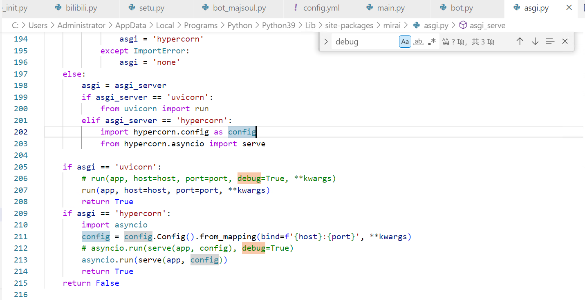
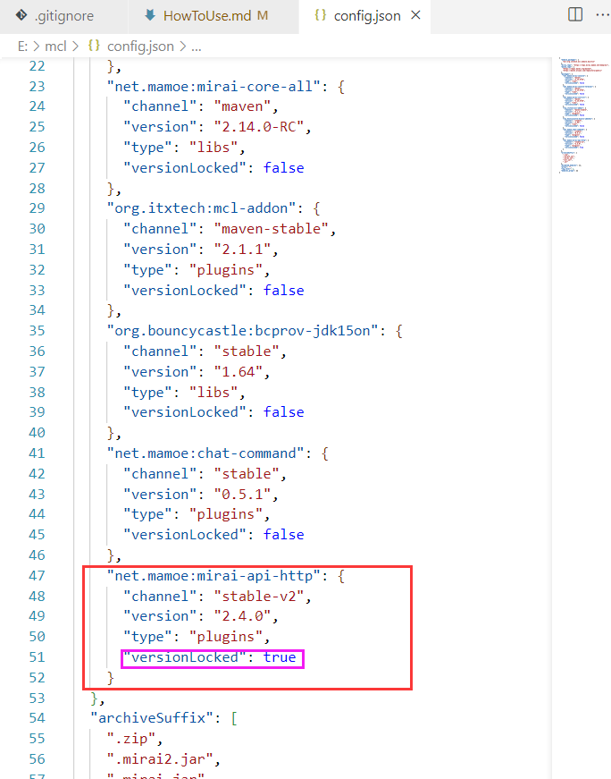
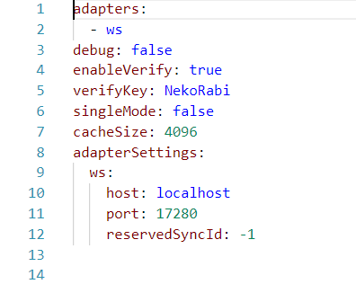

# 如何使用机器人

## 0. 下载文件

下载Mirai(MCL)，MajSoul-QQBot本体，mirai-api-http插件(版本2.4.0,下文简称 `mah`)

QQ群里肯定有

## 1. 安装环境和依赖，Java 和 Python
一些Mirai一键包提供了内置的Java，使用这些版本时不需要下载Java，Python需要为3.8+

Majsoul-QQBot我同样提供了两个版本，方便自定义的code版本和便于启动的exe版本，code版本需要下载依赖，更新及时；exe版本无需依赖(仅仅适配Windows 10 和 Windows Server 2019)

### 1.1 code版本的相关事项

1. 使用指令 `pip install -r requirements.txt`安装依赖，推荐使用豆瓣镜像源，即`pip install -r requirements.txt -i https://pypi.douban.com/simple`

2. 由于yirimirai的问题，当Python版本 > 3.9 时，asgi.py 会多提供参数导致报错，无法运行机器人，此时需要对依赖项的源码进行修改

3. 启动时会在一些方法上报错，此方法通常含有这样的参数，如`txt: List[str,str,tuple]`，解决方法为删除方括号及其内容

如图，python包默认安装在`C:\Users\[Username]\AppData\Local\Programs\Python\Python [version]\Lib\site-packages\`路径下，在此路径中找到文件`mirai\asgi.py`
在asgi.py的第206行和211行中，删去 `, debug=True` **(注意逗号)**

### 1.2 将mah插件放入mirai的plugins文件夹中
将 **指定版本** 的 mah插件放在mirai的plugins文件夹中

### 1.3 (如果有的话)锁定mah版本
**如果mirai目录下有config.json文件，没有该文件直接跳过**

打开该文件后，找到 `net.maome:mirai-api-http` ,设置 `"version":"2.4.0", "versionLocked" : true`,
具体修改为如图

## 2. 修改基本的配置文件

### 2.0 启动Mirai，生成配置文件

### 2.1 修改 `Mirai/Config/net.maome.mirai-api-http/setting.yml`

具体修改为如图 
其中`verifyKey` 和 `port` 可自定义

### 2.2 修改MajSoul-QQBot的配置文件

找到 `Majsoul-QQBot/config/config.yml` ，修改`adapter` 、 `botconfig` 和`master` 三项，其中 `adapter`  的 `port` 和 `verify_key` 两项需和 2.1 中的一致，`botname`为机器人昵称，会话中含有该词会触发自动回复，`master`为机器人主人QQ号

## 3. 启动程序，两个程序必须都开着

### 3.1 启动mirai，使用login QQ号 QQ密码进行登陆
**(可能)** 有多种启动方式，如 
双击`start.bat`或 `mcl.bat` ;
命令行中输入`start`或`mcl` ;
等等

### 3.2 启动Majsoul-QQBot

code版本可通过双击`start.bat`或者在命令行中输入`python main.py`启动，exe版本则直接双击`main.exe`

### 4. 有问题进群问

# 恭喜你，部署成功